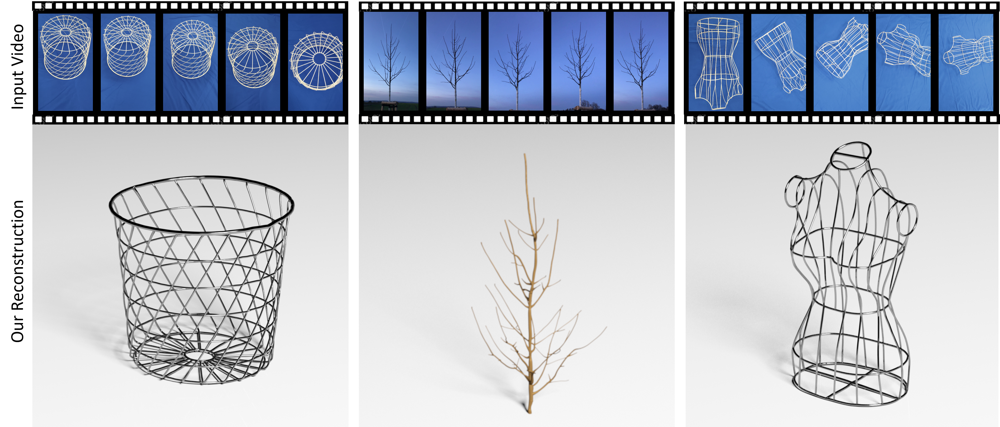

 

# Vid2Curve



This is the implementation for thin structure reconstruction from an image sequence.

## Dependency

- OpenCV (4.3.0)
- Boost (1.72.0)
- Ceres solver (1.14.0)
- OpenMP (10.0.0)
- glog (0.4.0)
- Eigen (3.3.7)
- Pangolin (optional, for the visualization of reconstruction process)

## Installation

This project is mainly developed and tested at Manjaro Linux. Please refer to the following steps to accomplish your installation.

- Clone the repository: 

```shell
git clone https://github.com/Totoro97/Vid2Curve.git
```

- Then run the following commands:

```shell
cd Vid2Curve
mkdir build
cd build
# ----- Default compile setting -----
cmake ..
make Display
# ----- Or compile with GUI(Pangolin) -----
cmake .. -DUSE_GUI=1
make Display
```


## Usage

At the `build` directory, run command `./Display` .

In the `config.ini` file, you can set the `DataPath` field for your own use and test.

The mesh and the curve skeleton will be saved as `curves_mesh.obj` and `curves.obj` at the `build` directory after the reconstruction process is done. And the camera poses will be saved at `cameras.txt` as rotation matrix and translation vectors (from world to camera).

## Data Preparation

In this repository we have prepared two simple [examples](./examples) for your quick validation. For more cases, please refer to the [link](https://drive.google.com/drive/folders/1jGPW8ZlKwg4qX82HWMW9l3pbhrAI0XNn?usp=sharing).

If you would like to use the project for reconstruction of your own thin objects, please prepare the data as the following steps:

- Prepare a sequence of segmented binary images (as the examples show).
  - 💡The project doesn't provide image distortion function, thus the input images should be undistorted in advance.
  - 💡It is hoped that images are captured from different view angles, to gain better reconstruction quality.
  - 💡Since the initialization step is rather important, the first several frames are hoped to have as few self-occlusions as possible.
  - 💡The recommended resolution of in the input images is between `500x500` and `1000x1000`.
- Create a `local_config.ini` file that indicates the internal parameters of the camera and some other informations (as the examples show).

## Citation

If you would like to use this project for your own use, please cite:

```
@article{wang2020vid2curve,
  title={Vid2Curve: Simultaneous Camera Motion Estimation and Thin Structure Reconstruction from an RGB Video},
  author={Wang, Peng and Liu, Lingjie and Chen, Nenglun and Chu, Hung-Kuo and Theobalt, Christian and Wang, Wenping},
  Journal={ACM Trans. Graph. (SIGGRAPH)},
  year={2020},
  Number={4},
  Volume={38},
  DOI={https://doi.org/10.1145/3386569.3392476},
  Publisher={ACM}
}
```

## Acknowledgment

This project also uses the codes from :

- OF_DIS, for computing optical flow  (https://github.com/tikroeger/OF_DIS)
- LSQR, for solving sparse linear system (https://web.stanford.edu/group/SOL/software/lsqr/)

Thanks for these great implementations.